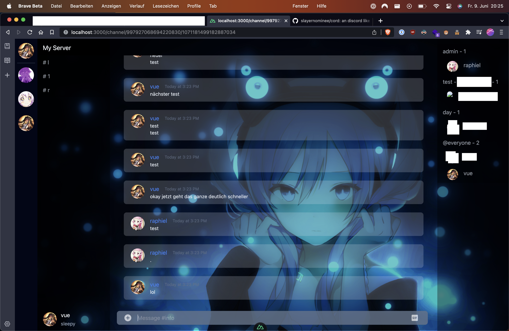

# Cord 

An Discord like Front End for Bots (basically a bot client)

**currently it is only a nice front end, im looking for a way to connect it to the discord api ...**



## Setup

Make sure to install the dependencies:

```bash
# npm
npm install
```

## Development Server

Start the development server on `http://localhost:3000`

```bash
npm run dev
```

## Production

Build the application for production:

```bash
npm run build
```

Locally preview production build:

```bash
npm run preview
```

Check out the [deployment documentation](https://nuxt.com/docs/getting-started/deployment) for more information.
